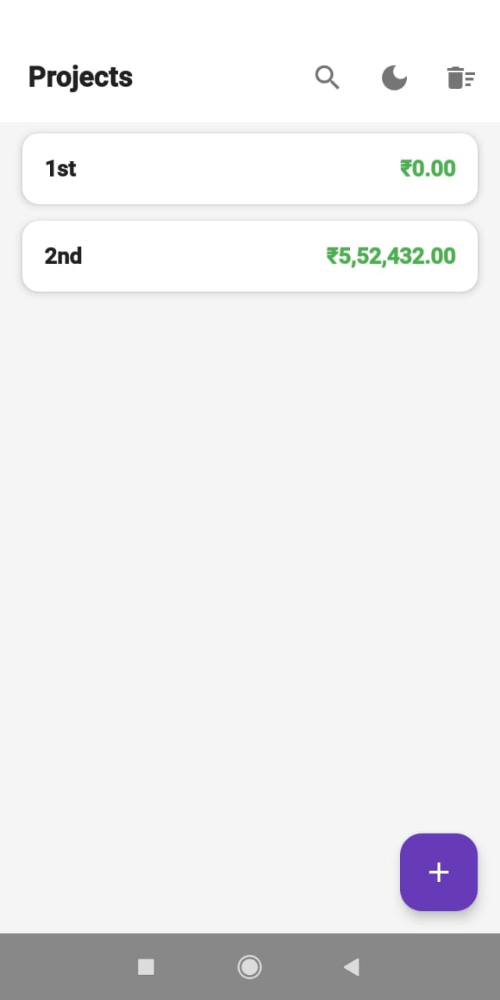
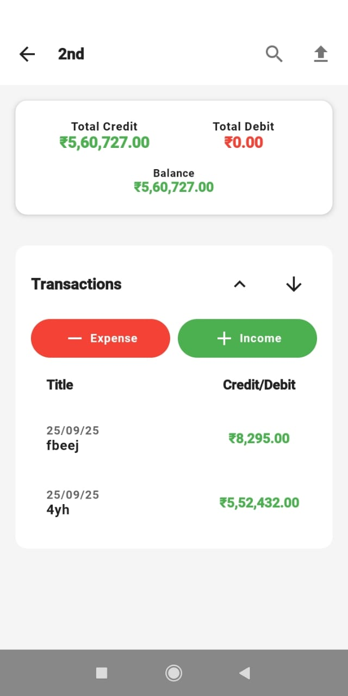
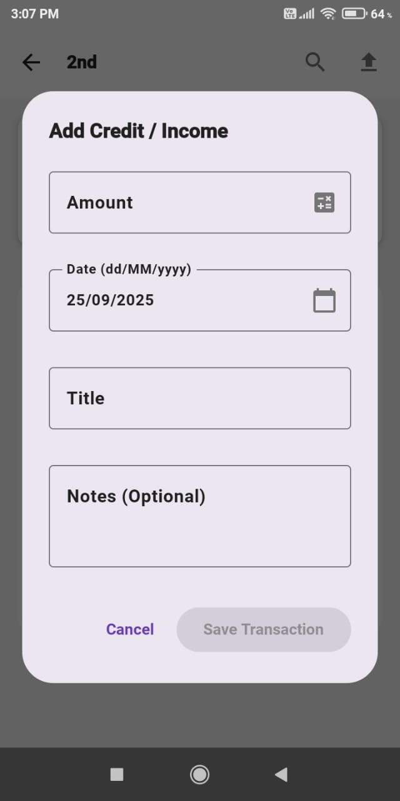
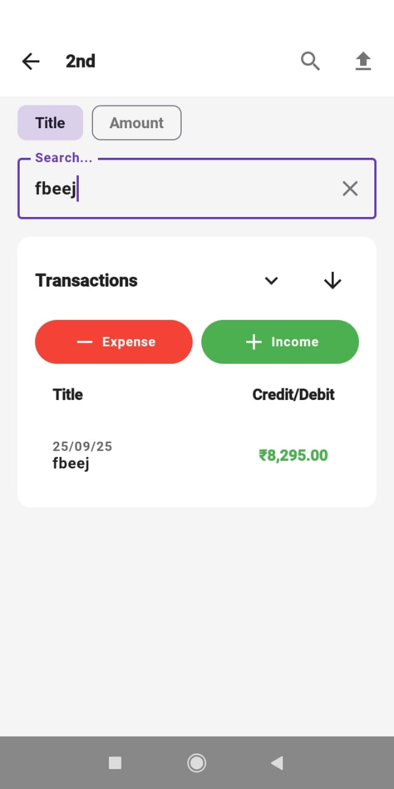

# Accounts Manager

[](https://github.com/papilo-topato/AccountsManagerApplication)
[-green)](https://developer.android.com/)
[](https://kotlinlang.org/)
[](https://developer.android.com/jetpack/compose)

An offline-first Android application, built with Jetpack Compose, for tracking project-based finances. Designed for freelancers, small businesses, and individuals who need simple, powerful financial management on the go.

**Supports Android 8.0 (Oreo) and above.**

---

## ✨ Features & Screenshots

A modern, clean interface built with Material Design 3, with full support for light and dark themes.

| Dashboard | Project Detail |
| :---: | :---: |
|  <br> Main dashboard with project list |  <br> Financial summary and transaction list |
| **Add/Edit Transaction** | **Search & Filter** |
|  <br> Transaction creation dialog |  <br> Real-time search and filtering |

### Core Features
*   **🏢 Project Management:** Create and manage multiple financial projects, each with a dedicated dashboard.
*   **💸 Transaction Tracking:** Easily add, edit, and delete income (credit) and expense (debit) transactions.
*   **📊 Financial Analytics:** Instantly see your total credit, debit, and running balance for each project, with a collapsible summary view.
*   **🔍 Powerful Search:** A real-time search that filters transactions by title or amount as you type.
*   **📤 CSV Data Export:** Export all transactions for a single project to a CSV file and share it with a single tap.
*   **🔒 Offline-First:** All features work perfectly without an internet connection. Your data lives securely on your device.
*   **🇮🇳 Currency Formatting:** Native support for the Indian numbering system (lakhs, crores).

---

## 🏗️ Tech Stack & Architecture

This project follows modern Android architecture best practices, ensuring a scalable and maintainable codebase.

*   **Architecture:** MVVM (Model-View-ViewModel) with a Repository pattern.
*   **UI Layer:** 100% [Jetpack Compose](https://developer.android.com/jetpack/compose) for building the UI, with [Material 3](https://m3.material.io/) components and a custom theme.
*   **Navigation:** [Navigation Compose](https://developer.android.com/jetpack/compose/navigation) for all in-app navigation.
*   **Data Layer:**
    *   **Persistence:** [Room Database](https://developer.android.com/training/data-storage/room) (SQLite) as the local data source.
    *   **Asynchronous:** [Kotlin Coroutines](https://kotlinlang.org/docs/coroutines-overview.html) and [Flow](https://kotlinlang.org/docs/flow.html) are used extensively for background operations and reactive data updates.

---

## 🚀 Building from Source

### Prerequisites
*   Android Studio Iguana | 2023.2.1 or later
*   Android SDK 26+ (Android 8.0)
*   Kotlin 1.8.0+

### Build Instructions

1.  **Clone the repository**
    ```bash
    git clone https://github.com/papilo-topato/AccountsManagerApplication.git
    cd AccountsManagerApplication
    ```

2.  **Open in Android Studio**
    *   Launch Android Studio and select `Open`.
    *   Navigate to the cloned project directory and open it.

3.  **Build and Run**
    *   Wait for the Gradle sync to complete.
    *   Select a device or emulator and click the "Run" button. The debug APK will be automatically built and installed.

---

## 🤝 Contributing

Contributions are welcome! If you'd like to help, please fork the repository and use a feature branch. Pull requests are warmly welcome.

If you found a bug, please create an issue with detailed reproduction steps.

## 📄 License

This project is licensed under the MIT License - see the [LICENSE](LICENSE) file for details.